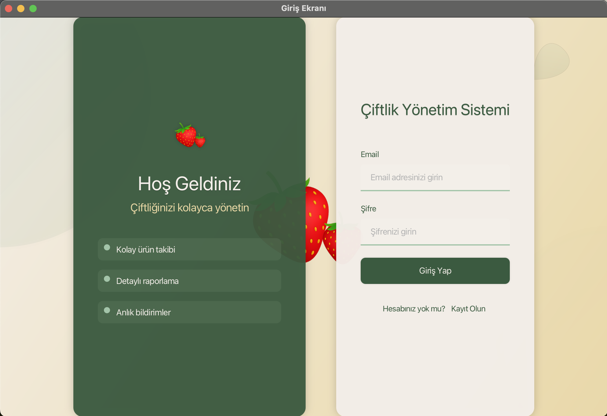
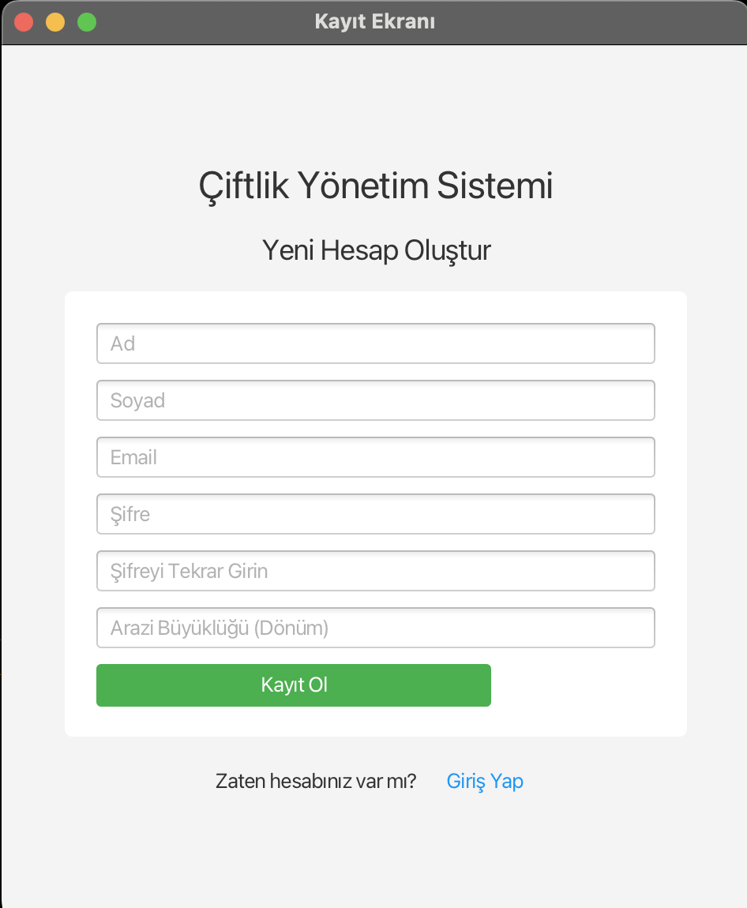
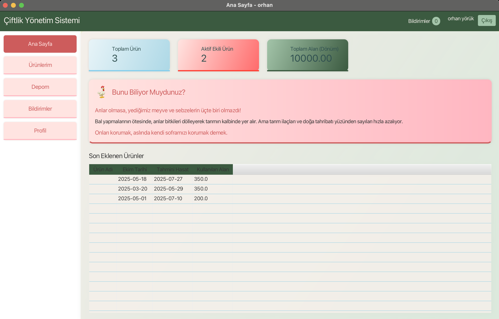
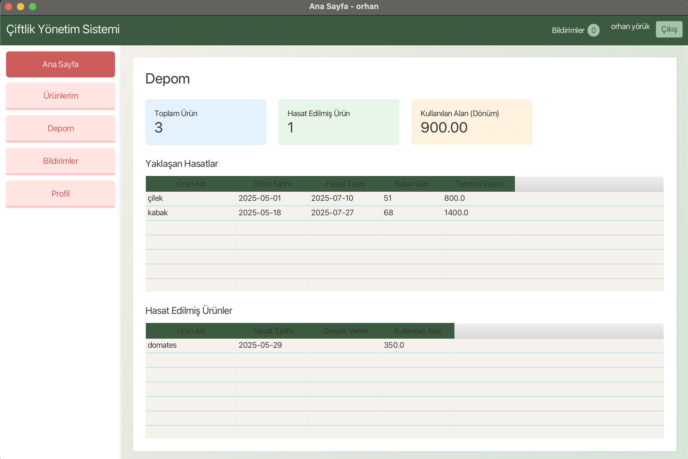

# FarmDay - Farm Management System
The aim of this project is to develop a system that enables farmers to manage their agricultural activities in an organized and efficient manner through a digital platform, while also ensuring the secure storage of their data. This system facilitates farmers’ work with features such as storage capacity monitoring and estimated harvest time tracking.

## Contents

- [About](#about)
- [Technologies Used](#technologies-used)
- [Installation and Usage](#installation-and-usage)
- [Images](#images)
- [Contributors](#contributors)
- [License](#license)

## About
This project aims to address a significant problem in today’s world, where unconscious agricultural practices are increasing and inefficient production is becoming widespread due to a lack of knowledge. Random or incorrect farming methods cause serious economic and environmental damage. For example, unnecessary irrigation or excessive planting not only reduces production but also decreases soil fertility in the long term.
This system guides users toward making more informed decisions by offering the opportunity for knowledge-based production.

## Technologies Used

- Java 17-23
- JavaFX
- CSS
- MySQL
- Visual Studio Code

## Installation and Usage

To run this application on your own computer, follow the steps below:

### Requirements
-Java JDK 17 or higher [Download Java JDK]
-Visual Studio Code (or another IDE that supports Java)
-Download JavaFX SDK from Gluon. https://gluonhq.com/products/javafx/    
-The JavaFX lib folder will be used. 
-An internet connection is required for database access.

### Usage
####  1. Run via IDE (Visual Studio Code)
-Clone or download the project files from GitHub to your local machine.

-Open the project folder with Visual Studio Code(recommended).

-Make sure the JavaFX .jar libraries inside the lib folder are correctly referenced in settings.json .
-In the .vscode file there is launch.json file. You may enter this file and change “vmArgs”: and change the path name according to your Javafx.sdk lib path name. 
-To update your JavaFX --module-path, you should point it to your local JavaFX SDK path. For example, if you downloaded and extracted JavaFX 17 to your Downloads folder, the path might look like this:

"--module-path C:/Users/esine/Downloads/openjfx-17.0.15_windows-x64_bin-sdk/javafx-sdk-17.0.15/lib --add-modules javafx.controls,javafx.fxml"

-Launch the application by running the Main.java file.

-Ensure you have an active internet connection to connect to the remote MySQL database.
### Images

## Contributors

| Name           | Contribution                                               					     |                                                      
|----------------|------------------------------------------------------------------------------------------------------|
| Esin Enni      | Database connection, warehouse operations (Java code and MySQL tables), server configuration, UI design, and report writing. 					           	|
| Neslihan Sandıkcı | User login/logout features, User and Farmer classes (Java code and MySQL tables), UI design, and report writing.            |
| Feyza Öztürk   | Product-related methods, adding products, setting specific harvest dates, yield calculation, MySQL tables, UI design, and report writing. |
| Simge Altın    | Notification-related classes (Notification, NotificationService), MySQL tables, UI design, and report writing.                |

